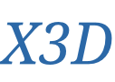

<div align="right">
  语言:
    🇨🇳
  <a title="英语" href="./README.en.md">🇺🇸</a>
  <!-- <a title="俄语" href="../ru/README.md">🇷🇺</a> -->
</div>

 <div align="center"><a title="" href="https://github.com/ZJCV/X3D"></a></div>

<p align="center">
  «X3D»复现了论文<a title="" href="https://arxiv.org/abs/2004.04730">X3D: Expanding Architectures for Efficient Video Recognition </a>提出的视频分类模型
<br>
<br>
  <a href="https://github.com/RichardLitt/standard-readme"></a>
  <a href="https://conventionalcommits.org"></a>
  <a href="http://commitizen.github.io/cz-cli/"></a>
</p>

其`CodeBase`来自于[ZJCV/Non-local](https://github.com/ZJCV/Non-local)

## 内容列表

- [内容列表](#内容列表)
- [背景](#背景)
- [安装](#安装)
- [使用](#使用)
- [主要维护人员](#主要维护人员)
- [致谢](#致谢)
- [参与贡献方式](#参与贡献方式)
- [许可证](#许可证)

## 背景

论文作者详细的分析了之前的视频理解模型的发展，提出`6`个关键变量，通过逐步测试的方式搜索更好的模型，最终得到`6`个不同变量大小的`X3D`模型

## 安装

通过`requirements.txt`安装运行所需依赖

```
$ pip install -r requirements.txt
```

处理数据时需要额外安装[denseflow](https://github.com/open-mmlab/denseflow)，可以在[innerlee/setup](https://github.com/innerlee/setup)中找到安装脚本

## 使用

首先设置`GPU`和当前位置

```
$ export CUDA_VISIBLE_DEVICES=1
$ export PYTHONPATH=.
```

## 主要维护人员

* zhujian - *Initial work* - [zjykzj](https://github.com/zjykzj)

## 致谢

* [ facebookresearch/SlowFast](https://github.com/facebookresearch/SlowFast)
* [open-mmlab/mmaction2](https://github.com/open-mmlab/mmaction2)

```
@misc{feichtenhofer2020x3d,
      title={X3D: Expanding Architectures for Efficient Video Recognition}, 
      author={Christoph Feichtenhofer},
      year={2020},
      eprint={2004.04730},
      archivePrefix={arXiv},
      primaryClass={cs.CV}
}
```

## 参与贡献方式

欢迎任何人的参与！打开[issue](https://github.com/ZJCV/X3D/issues)或提交合并请求。

注意:

* `GIT`提交，请遵守[Conventional Commits](https://www.conventionalcommits.org/en/v1.0.0-beta.4/)规范
* 语义版本化，请遵守[Semantic Versioning 2.0.0](https://semver.org)规范
* `README`编写，请遵守[standard-readme](https://github.com/RichardLitt/standard-readme)规范

## 许可证

[Apache License 2.0](LICENSE) © 2020 zjykzj